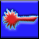

# Battleship

Classic battleship game with different bonuses and penalties.  
Made for fun. Coding by [Asamarus](https://github.com/asamarus). Icons design by [enoraso](https://github.com/enoraso)  
Bonuses and penalties can be turned on/off in game settings.

[Live demo](https://asamarus.github.io/battleship)

## Installation

1. Clone or download the repository.
2. Run `npm install` to install dependencies.
3. Run `npm run start` to launch a webpack dev server.

## Bonuses

  
Gives you one extra shot. 

  
Gives you two extra shots.

  
Attacks all enemy cells in the horizontal direction.

  
Attacks all enemy cells in the vertical direction.

  
Moves one of your ships in a new random position.

  
Repairs one of your sunken ships.

  
It attacks cells in the form of a cross.

  
Shows enemy ships in selected area.

## Penalties

  
Attacks your own cell with same coordinates.

  
Attacks your own cell with random coordinates.

  
You need to answer question. If answer is incorrect you lose your turn.

## Cheats

You can enable cheats in game settings.
